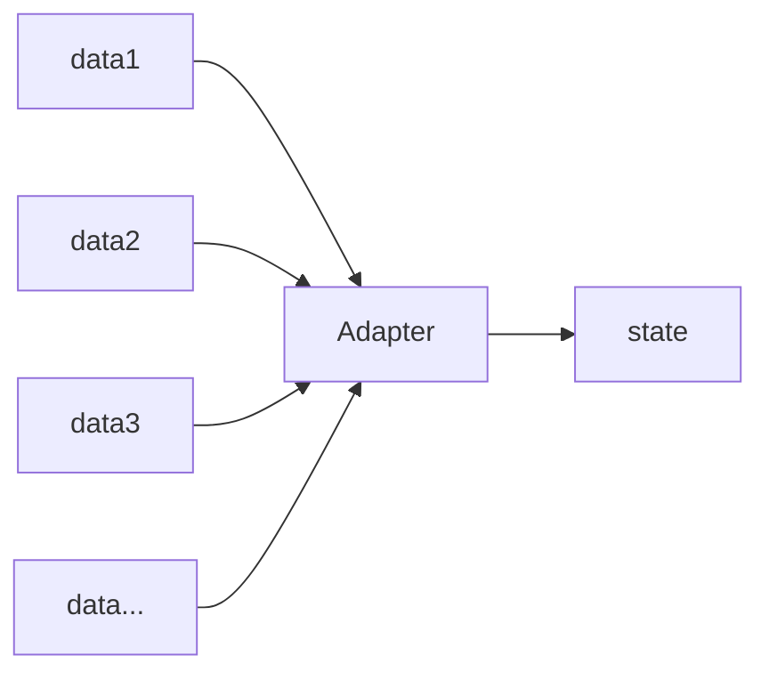
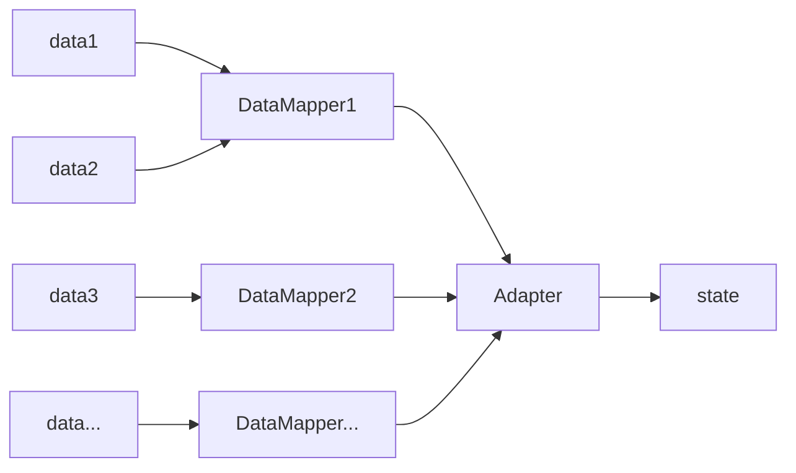

<script src='https://unpkg.com/mermaid/dist/mermaid.min.js'></script>
<script>
  if (window.mermaid) {
    mermaid.initialize();
  }
</script>
<style>
  .gutter { display: none; }
</style>

## 背景


- PC主站 `edu_web_3.0` (`react` + `umi` + `dva`)合并训练营相关业务
- 不同的接口数据
  - 精品课接口返回数据(以下称精品课数据)
  - 训练营接口返回数据(以下称训练营数据)
  - 后台将训练营接口合并到dynamicedu中并统一返回基本结构(code + data + msg)
- 相似的页面
  - 课程详情页 ≈ 训练营详情页
  - 课程音/视频页 ≈ 训练营音/视频页
  - 新增图文详情页, 作业详情页, 结构与音/视频页相似
- 复用的组件
  - 之前的组件(以下称老组件)大部分与精品课数据耦合, 即大部分是 `container` 组件
- 数据流
  - 课程相关数据通过状态管理保存在 `models/courseData` 中
  - 相关 `page` 和 `container` 都会从 `courseData` 中拿到想要的数据
  - 在 `modules/global` 里通过监听 `history` 来请求基本数据

## 项目思路


- 首先添加新版本 `v3.2.0` (即分支名)
- 页面:
  - 将训练营详情页融入课程详情页
  - 将训练营音/视频页融入课程音/视频页
  - 新增图文/作业详情页, 从课程音/视频页复制并进行修改
- 组件:
  - 相似相近内容使用老组件
  - 新增内容创建新的 `component` 或 `container`
- 数据:
  - 接口请求使用老方法
  - 接口数据通过 __`Adapter`__ 加入到 `courseData` 中
  - 为了节约时间, 只把老组件要使用训练营数据的进行  __`Adapter`__, 新组件直接使用训练营数据

## __Adapter__

直译为适配器, 为了解决接口数据差异而生, 这里接口, 不只是数据接口, 可以扩展为组件接口等

也就是说,  __`Adapter`__ 用来将传入的数据进行转义并输出为正确的格式以使用



上面模型适合从一种数据格式转换为另一种数据格式, 将转换放到 __`Adapter`__ 中

但后续遇到了问题, 精品课数据不同接口返回的数据格式也不相同, 即后台没有统一数据格式

所以对上面模型进行加工, 使其支持从多种数据格式转换为一种数据格式



添加了一层 `DataMapper`, 用来保存转换规则和提供转换方法, 而 __`Adapter`__ 只用来调用转换方法

具体示例如下:

``` js
import CourseData from '@/constants/adapter/CourseData'
import TrainingData from '@/constants/adapter/TrainingData'

...
  const courseDetail = isTraining
    ? new Adapter(new TrainingData(res.data)).export('courseData')
    : res
...
  yield put({
    type: 'UPDATE_TEACHER_INFO',
    payload: new Adapter(new CourseData(res)).export('courseData.teacher')
  })
...
  chapterList.push(new Adapter(new TrainingData(ele)).export('courseSchedule'))
...

```
