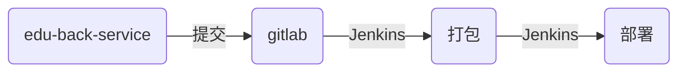

<script src='https://unpkg.com/mermaid/dist/mermaid.min.js'></script>
<script>
  if (window.mermaid) {
    mermaid.initialize();
  }
</script>

## 现在长啥样

先屡屡咱的项目们

- edu-m-2.0 传说级, vue全家桶
  - 什么都有
  - 缺乏rebuild
- edu-back-service 史诗级, vue with nuxt
  - ssr
  - 权限
  - 功能接口
  - 缺乏rebuild
  - 缺乏升级
- edu-activity 平民级, vue全家桶
  - emmm, 没什么印象
  - 缺乏通用包管理
- edu_web_v3 现象级, umi全家桶

现在在用的也就这么几个了

为什么这么少, 一个是把活动页放在一个项目里, 另一个原因是业务的合并以及缺乏开拓性(短时间内也必然没有开拓性, 毕竟产品换了好几茬)

而且未来很长一段时间, 就这么几个项目了

所以呢, 先简单屡屡现在的开发和部署

### 本地开发

从公司的gitlab上拉下来代码

使用npm或yarn安装包依赖 (有一些包需要全局安装但是不推荐, 尽量把所有依赖都放到devDependences里)

创建开发分支, 一般以 `feature/` 或 `hotfix/` 开头, 比如 `feature/training`, `hotfix/upload`

或者直接使用版本号, 比如 `v3.2.0`

TODO: auto changelog, 分支名+提交内容

使用本地开发环境进行开发, 如 `umi dev`, `vue-cli-service serve`, `nuxt` 等

其实都是 based on webpack (edu-back-service 使用了 nodemon), 开启本地文件监听, 编译和浏览器自动刷新或hot-reload

开始写代码, 写代码没啥说的

然后git提交代码, 可能会有一个pre-commit的步骤, 一般执行 `lint` 或 `lint-staged`, 基于eslint

git push

### 部署测试环境

我现在本地开发的分支推到gitlab上了, 其实后面的事情就跟你没关系了, 因为这些工作属于一个叫 DevOps 的工种

顺便说一下, 咱们的工种叫 font-end

devOps 是纯粹运维和纯粹开发中间的一个人, 这边搞一点, 那边也搞一点

回到正题, 我们要部署测试环境了

测试环境, 是局域网内部才能访问的一个环境, 需要绑host

外网无法访问(不过支付需要外网可以访问), 需要VPN

以前, 我们有 __测试环境__ 和 __准测环境__ 两个测试环境, 但现在只有一个了

所以, 不能奢侈的一个分支, 一个测试环境了

所以, 我们要把所有要用测试环境分支合并到一个分支内, 然后部署测试环境

这个分支一般是 `dev` 或 `development` (以下称为 `dev分支`)

目前有两种分支合并到dev分支

1. 本地切到dev分支, pull, merge本地分支, push
2. gitlab里创建merge-request, from本地分支, target是dev分支, 然后合并

TODO: auto merge-request

然后使用Jenkins或kae部署到测试环境

在这儿先回忆一下当年...

## 忆当年

词霸那会儿, 前端还没有使用Jenkins, 前端代码还是放到后台项目中


- 缺点
  - 很麻烦, 部署一次, 要两个项目的git pull, commit, push
- 优点
  - 没想到

后来精品课开始搞了, 优化了一点, 给我们弄了个几个Jenkins任务用来部署静态文件


- 优点
  - 前后端分离
  - 直接使用Jenkins部署前端
- 缺点
  - 只部署静态文件
  - 本地打包的话, 不同开发人员有可能会因为npm包版本问题打出不同的包

再后来, edu-back-service 横空出世, 作为一个node服务端, 享受了高配的待遇:



- 优点
  - 打包和部署都在Jenkins上进行(其实是一个任务), 避免出现包版本不一致的问题
- 缺点
  - 打包时间超长, 10-20分钟, 比后台都长

接下来, 就是现在的部署方式了

## 现在的部署

接上文, 在git提交并merge到dev分支后, 就要开始部署了

部署测试环境和部署正式环境是一样的, 只是服务器的多少

先说Jenkins的

`edu-m-2.0`, `edu-activity`, `edu_web_v3` 都是使用的Jenkins

比之前使用Jenkins部署静态文件时, 现在的把打包也放进Jenkins中

- 之前的:

  ```mermaid

  graph LR;
    A(开发项目) --本地打包--> B(dist文件夹) --提交--> C(gitlab) --Jenkins--> D(部署)

  ```

- 现在的:

  ```mermaid

  graph LR;
    A(开发项目) --提交--> B(gitlab) --Jenkins--> C(打包) --Jenkins--> D(部署)

  ```

优缺点和之前edu-back-service一样, 打包时间较长, 而且部署线上时, 打包后会将大部分资源文件上传到CDN, 用时更长

TODO: 使用npm包上传文件到cdn, 该npm包更新时Jenkins如何处理

Jenkins支持gitlab触发自动构建和部署

比如dev分支merge了你的开发分支(实际上是一次提交), gitlab会触发Jenkins的任务, 然后打包和部署dev分支的代码

然后说一下kae的, kae是集团内部的运维平台

----

(接上次)

目前 `edu-back-service` 后台管理系统通过kae部署测试环境和正式环境

kae的具体技术咱就不细说了, 这儿说一下它的痛点(强迫症): 需要点一下才能构建

它目前不支持gitlab分支提交触发, 不支持api触发(对比为node-jenkins, 可以使用token来请求jenkins接口)

传送门: [node-jenkins](https://github.com/silas/node-jenkins)

目前我想到的解决办法是使用electron模拟点击

使用electron打开指定的kae页面, 然后模拟点击进行构建, 然后通过刷新页面判断是否构建完成

TODO: 使用electron在kae自动构建

基本现在的模式(初始化, 仓库, 本地开发, 测试部署, 线上部署)就是这个样子了

欢迎补充

下面说的都是我自己的一些畅想了

## 畅想

命令行 or 客户端

要做的是把复杂的事情简单化

最简单的还是客户端, 但它的开发成本要比命令行多很多

之前在命令行也有尝试, 做了分支名lint和cdn上传

现在分支名lint没有在用了

cdn上传因为将打包放到了打包机上, 它也就变成了一个单纯的工具了

所以现阶段, 做一个客户端比较合适, 比较我们的目标是功能强大, 操作简单

选取的工具是electron

然后说一下产品设计

### 功能一: 嵌入和整合相关网站

把gitlab, Jenkins, kae等用到的放进来

尝试加一个自动登录, 即把登录信息保存, 再次登录时自动填充

尝试加上指定页面的自动点击, 比如上面说的kea的构建按钮

### 功能二: 本地项目的管理

参考的vue的ui功能

尝试编辑器打开项目

尝试加入或移除@edu-fe的包

尝试执行本地命令并输出

尝试增加模版功能, 在创建新的page/component/container/module/api等时

尝试增加新建项目的功能, 使用@vue/cli, umijs, create-react-app

尝试git拉取项目信息, 比如当前是什么分支, 当前分支落后远端master分支多少

又比如master分支本地和远端差多少, dev分支本地和远端差多少

尝试加入git分支lint

尝试加入git提交lint

### 功能三: 文档管理

做文档是一个比较犹豫的事情

因为文档分几种, 有业务相关的, 有技术相关的, 有配置相关的, 有部署相关的

有的分散在各个业务项目里, 有的在后台的文档里

在客户端里, 我想做一个前端的文档

首先有编辑和展示, 比如咱们的分享

其次可以抓取gitlab中项目的.md文件

然后可以抓取指定链接的文档

看着像是要做一个服务器, 我在想是做个node服务还是做到electron的自动更新里(这个其实也需要node服务, 只是侧重点不同)

### 功能四: 还没想好

以上都是些设想, 我非常看好electron, 确切的说是桌面客户端

通过前端工具进行切入, 是目前能想到的方式之一

希望大家可以多参与
